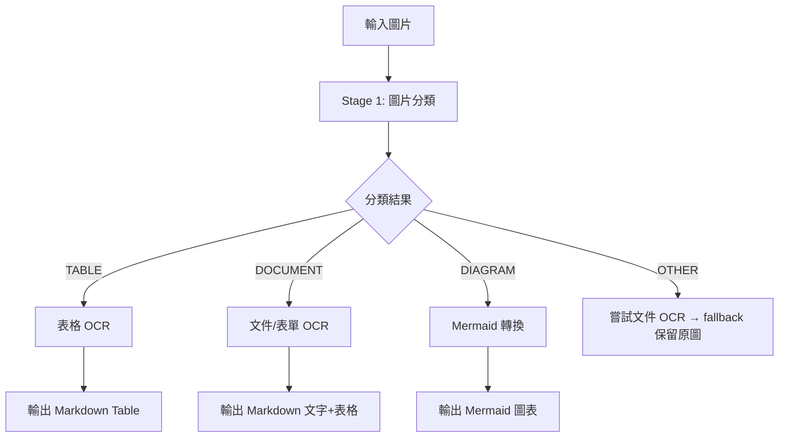

# pdf2md 圖片處理管線改善

## 問題診斷

原本的 `process_image` 流程只有兩條路線：

```
圖片 → 嘗試表格 OCR → 失敗 → 直接當作 Mermaid 圖表
```

像 "目標與投資細節.png" 這種**表單/文件型圖片**（包含標題、文字、checkbox、表格混合內容），表格 OCR 回傳 `NOT_A_TABLE`（因為不是「純表格」），就直接被路由到 Mermaid 轉換，產生了不合適的 flowchart 輸出。

## 改善方案：三階段分類管線



## 修改的檔案

### 新增檔案
| 檔案 | 說明 |
| --- | --- |
| [vision_classify.md](file:///Users/stevenlee/projects/pdf2md/prompts/vision_classify.md) | 圖片分類 prompt，輸出 TABLE / DOCUMENT / DIAGRAM / OTHER |
| [vision_to_document.md](file:///Users/stevenlee/projects/pdf2md/prompts/vision_to_document.md) | 文件/表單 OCR prompt，支援混合內容（標題、文字、表格、checkbox） |

### 修改的檔案

| 檔案 | 主要變更 |
| --- | --- |
| [llm_client.py](file:///Users/stevenlee/projects/pdf2md/src/llm_client.py) | 新增 `async_vision_classify`、`async_vision_to_document`、共用 `_async_vision_call` |
| [enhancer.py](file:///Users/stevenlee/projects/pdf2md/src/enhancer.py) | 重構 `process_image` 為分類驅動路由；新增 `_handle_table`/`_handle_document`/`_handle_mermaid`；Mermaid 重試機制、語法驗證 |
| [vision_to_mermaid.md](file:///Users/stevenlee/projects/pdf2md/prompts/vision_to_mermaid.md) | 強化 prompt：加入 NOT_A_DIAGRAM 逃脫機制、禁止分號、更嚴格引號規則 |

## Mermaid 穩定性改善

1. **重試機制**：`_handle_mermaid` 支援 `max_retries=2`，若第一次生成無效會自動重試
2. **`is_valid_mermaid` 驗證**：檢查是否包含有效關鍵字、結構標記（箭頭/節點）、最低長度
3. **`validate_mermaid` 後處理**：
   - 修復未閉合括號
   - 移除行尾分號
   - 確保第一行是有效 diagram type 宣告
4. **Prompt 改善**：新增 `NOT_A_DIAGRAM` 逃脫機制，避免非圖表圖片被強制轉為 Mermaid

## 預期效果

| 圖片類型 | 改善前 | 改善後 |
| --- | --- | --- |
| 目標與投資細節.png（表單） | ❌ Mermaid flowchart | ✅ Markdown 文字 + 表格 |
| 投資經驗.jpg（表格為主） | ❌ Mermaid flowchart | ✅ Markdown 表格或文件 |
| 投資經驗B.png（有填寫的表格） | ✅ Markdown 表格 | ✅ Markdown 表格（不變） |
| 真正的流程圖 | ✅ Mermaid | ✅ Mermaid（更穩定） |

## 測試建議

```bash
# 刪除舊輸出後重跑
rm pdf2mdVault/output_dir/目標與投資細節.md
./start.sh
# 或直接跑單檔
source venv/bin/activate
python -m src.cli --input pdf2mdVault/input_dir --output pdf2mdVault/output_dir --force
```
